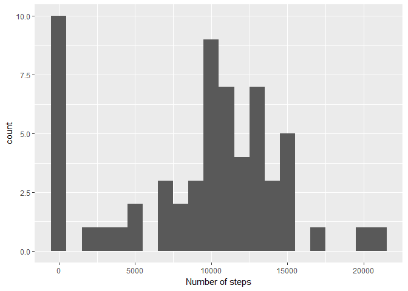
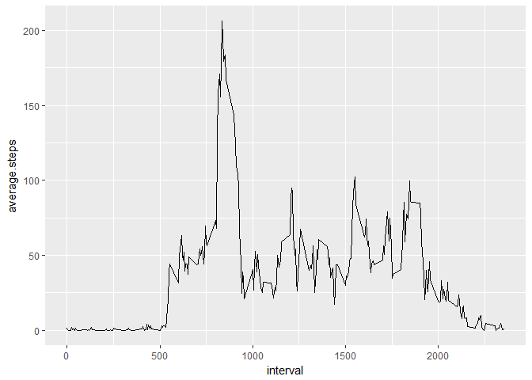
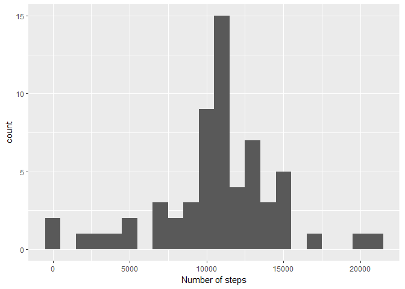
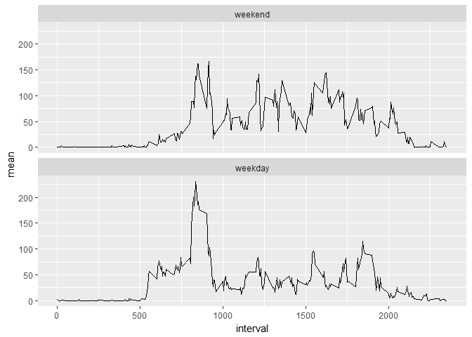

# Reproducible Research: Peer Assessment 1

## Introduction
This file contains the script for the week 2 peer review project of the course 'Reproducible Research'. It is assumed the file activity.csv 
is present in the working directory.

The first step is lading the necesarry libraries


```r
library(lubridate)
```

```
## 
## Attaching package: 'lubridate'
```

```
## The following object is masked from 'package:base':
## 
##     date
```

```r
library(dplyr)
```

```
## 
## Attaching package: 'dplyr'
```

```
## The following objects are masked from 'package:lubridate':
## 
##     intersect, setdiff, union
```

```
## The following objects are masked from 'package:stats':
## 
##     filter, lag
```

```
## The following objects are masked from 'package:base':
## 
##     intersect, setdiff, setequal, union
```

```r
library(ggplot2)
```

## Loading and preprocessing the data

We load the csv file and transform the data column into a proper date format.


```r
activity <- read.csv("activity.csv")
activity$date <- ymd(activity$date)
```


## What is mean total number of steps taken per day?

Calculate the mean and median value of the the number of steps ater grouping by day and make an histogram


```r
activity_day <- activity %>% group_by(date) %>% summarize(total.steps = sum(steps, na.rm = TRUE))
qplot(activity_day$total.steps, xlab="Number of steps", binwidth=1000)
```

<!-- -->

```r
mean(activity_day$total.steps, na.rm=TRUE)
```

```
## [1] 9354.23
```

```r
median(activity_day$total.steps, na.rm=TRUE)
```

```
## [1] 10395
```

the average number of steps per day is 9354, and the median number of steps is 10395.

## What is the average daily activity pattern?

We calculate the average number of steps in each interval by grouping them by interval and takeing the average number of steps. 
We show how the number of steps changes during the day by plotting in a time series graph. We also calculate the interval in which, on average, most steps are taken. 


```r
activity_pattern <- activity %>% group_by(interval) %>% summarize(average.steps = mean(steps, na.rm = TRUE))
ggplot(activity_pattern, aes(interval,average.steps)) + geom_line()
```

<!-- -->

```r
activity_pattern$interval[which.max(activity_pattern$average.steps)]
```

```
## [1] 835
```

It turn out the most active interval is 835.   

## Imputing missing values

The number of missing values is calucated by creating a logical vector with TRUE if the steps value is missing. The number is calculated by summing over the true values. Next we input the missing values by the average for that interval over all days as calcultated in the previous steps.

Finally, we recreate the histogram and recalcute the mean and average


```r
activity_with_average <- merge(activity, activity_pattern, by="interval")
activity_fixed <- mutate(activity_with_average, steps = ifelse(is.na(steps), average.steps , steps))
activity_day_fixed <- activity_fixed %>% group_by(date) %>% summarize(total.steps = sum(steps))
qplot(activity_day_fixed$total.steps, xlab="Number of steps", binwidth=1000)
```

<!-- -->

```r
mean(activity_day_fixed$total.steps, na.rm=TRUE)
```

```
## [1] 10766.19
```

```r
median(activity_day_fixed$total.steps, na.rm=TRUE)
```

```
## [1] 10766.19
```

There are 2304 missing values, 13.1 % of all values.
The plots looks a bit smoother, and the average has increased.

## Are there differences in activity patterns between weekdays and weekends?

We create a new factor for weekdays and weekends, then calculate the average number of steps of each interval for each kind of day.
The data is plotted so we can see the difference in activity during weekdays and weekends.


```r
weekdays <- c('Monday', 'Tuesday', 'Wednesday', 'Thursday', 'Friday')
activity_weekday <- mutate(activity_fixed, daykind = factor((weekdays(activity_fixed$date) %in% weekdays), levels=c(FALSE, TRUE), labels=c('weekend', 'weekday')))
activity_daykind <- activity_weekday %>% group_by(daykind, interval) %>% summarize(mean =mean(steps))
ggplot(activity_daykind, aes(interval,mean)) + geom_line() + facet_wrap(~ daykind, ncol=1)
```

<!-- -->

